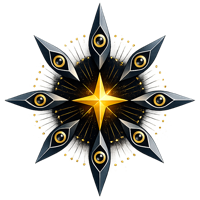
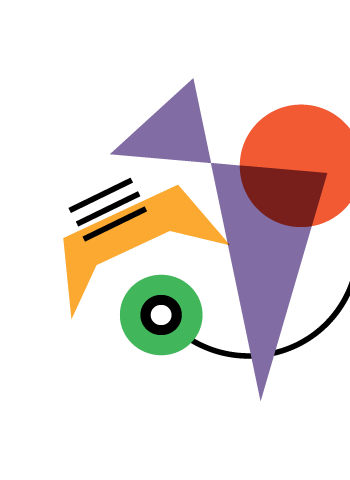

# Hi, I'm Georgy

ML engineer & researcher. LLM agents, ML security, NLP.

---

### Competitions

**[AgentX-AgentBeats](https://github.com/dmagog/mle-purple-agent)** — Berkeley RDI, MLE-bench track 
Autonomous ML agent for Kaggle competitions via A2A protocol · Apr 2026

 

---

### Projects

**[Sirius-Argus](https://github.com/dmagog/Sirius-Argus)** 
MLSecOps platform — threat coverage map, RBAC, HITL gates
 

**[ATLAS phd](https://github.com/dmagog/ATLAS-phd)** 
LLM assistant for PhD qualifying exam preparation
 

---

### Research

**[hallu-probe](https://github.com/dmagog/smiles-2026-hallu-probe)** 
LLM hallucination probing (SMILES 2026)
 

**[agent-security](https://github.com/dmagog/airi-agent-security-proposal)** 
LLM agent security (AIRI Summer School 2026)
 

**[persona-emotions](https://github.com/dmagog/persona-emotions)** — Emotion steering vectors in LLMs
