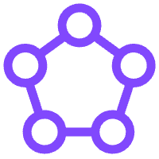
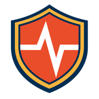
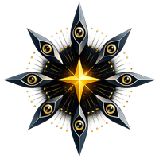
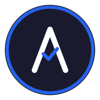
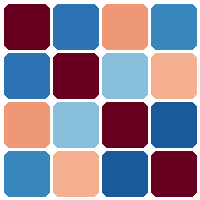
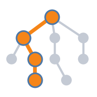
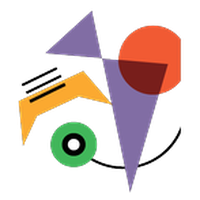

# Hi, I'm Georgy

ML engineer & researcher. LLM agents, ML security, NLP.

 [Kaggle Code & Datasets Expert](https://www.kaggle.com/georgymamarin)

---

### Competitions

**[AgentX-AgentBeats](https://github.com/dmagog/mle-purple-agent)** — Berkeley RDI, MLE-bench track 
Autonomous ML agent for Kaggle competitions via A2A protocol · Apr 2026

 

---

### Projects

**[Pulse STD](https://github.com/dmagog/PulseSTD)** 
Student dashboard — schedule, assignments, deadlines
 

**[Sirius-Argus](https://github.com/dmagog/Sirius-Argus)** 
MLSecOps platform — threat coverage map, RBAC, HITL gates
 

**[ATLAS phd](https://github.com/dmagog/ATLAS-phd)** 
LLM assistant for PhD qualifying exam preparation
 

**[Kaggle Pulse](https://github.com/dmagog/kaggle-pulse)** 
Kaggle stats tracker — daily Meta snapshots, medal-eligible votes, named supporters
 

---

### Research

**[persona-emotions](https://github.com/dmagog/persona-emotions)** 
Emotion steering vectors in LLMs
 

**[eagle3-qwen3](https://github.com/dmagog/eagle3-speculative-decoding)** 
Speculative decoding on Qwen3: anatomy of a speedup (YSDA at Sirius 2026)
 

**[hallu-probe](https://github.com/dmagog/smiles-2026-hallu-probe)** 
LLM hallucination probing (SMILES 2026)
 

**[agent-security](https://github.com/dmagog/airi-agent-security-proposal)** 
LLM agent security (AIRI Summer School 2026)
 
